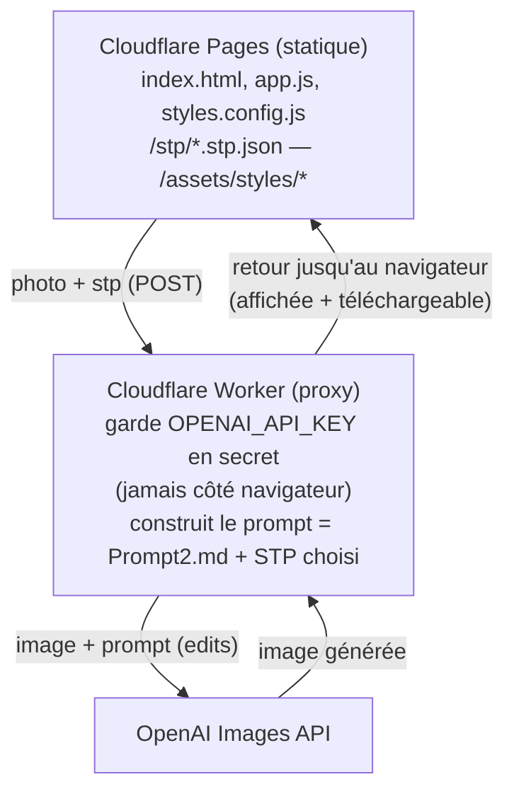
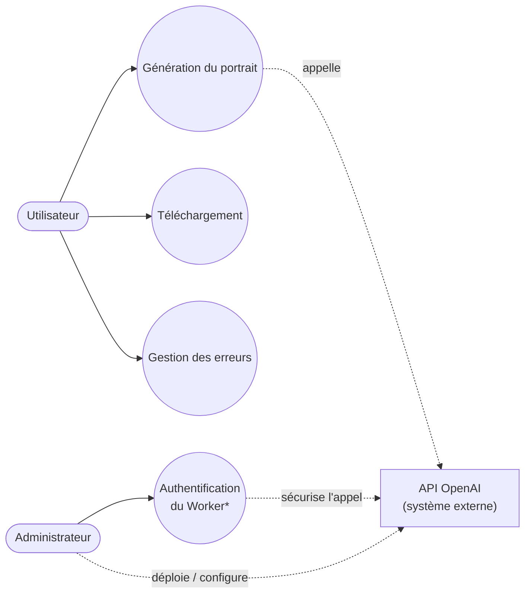
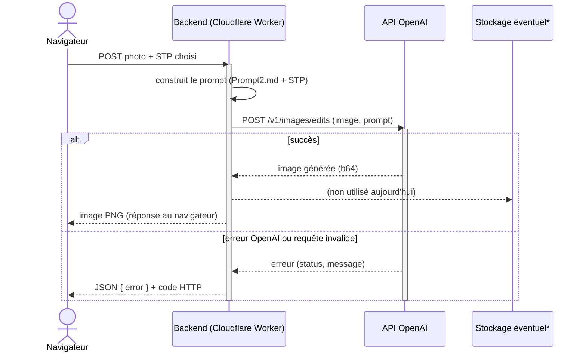
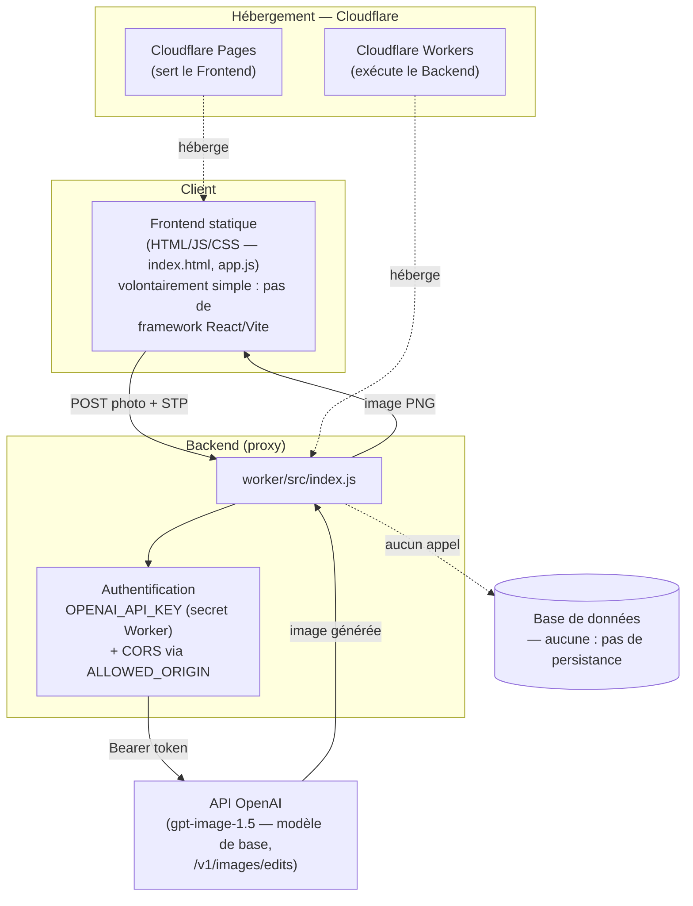

# Photo Pro

Site statique (Cloudflare Pages) qui transforme une photo en portrait professionnel
via l'API Images d'OpenAI, en réappliquant uniquement le *style* photographique
d'une référence (STP — Style Transfer Profile) sans jamais modifier l'identité
du sujet.

## Architecture



La clé API OpenAI n'existe jamais côté navigateur : elle est stockée comme
secret sur le Worker Cloudflare, qui sert de proxy entre le site public et
l'API OpenAI.

## Diagrammes UML

> Le site n'a pas de compte utilisateur ni de base de données : ces éléments
> apparaissent ci-dessous pour respecter le vocabulaire UML classique, avec
> une note quand ils ne s'appliquent pas tels quels au projet.

### Diagramme de cas d'utilisation



\* Pas de login utilisateur : "Authentification" désigne la clé
`OPENAI_API_KEY` stockée comme secret Cloudflare Worker, configurée par
l'administrateur lors du déploiement.

### Diagramme de séquence



\* Aucun stockage n'est implémenté actuellement : les images transitent
uniquement le temps de la requête (voir [Notes](#notes)). La ligne apparaît
en pointillés pour montrer où un stockage (ex. R2, S3) pourrait s'insérer.

### Diagramme de composants



## Structure du dépôt

```
index.html, app.js, style.css, styles.config.js   → site Cloudflare Pages
stp/                                                → bibliothèque de STP (un par style)
assets/styles/                                      → miniatures avant/après des styles
scripts/generate-stp.mjs                            → génère un .stp.json à partir d'une photo de référence
worker/                                              → Cloudflare Worker (proxy OpenAI)
Prompt1.md                                           → prompt d'analyse (photo → STP)
Prompt2.md                                           → prompt de génération (photo + STP → image)
```

## 1. Déployer le Worker Cloudflare

```bash
cd worker
npm install
npx wrangler login
npx wrangler secret put OPENAI_API_KEY
```

Édite `worker/wrangler.toml` et remplace `ALLOWED_ORIGIN` par l'origine
exacte de ton site Cloudflare Pages (ex. `https://photo-pro.pages.dev` ou ton
domaine personnalisé).

```bash
npx wrangler deploy
```

Note l'URL affichée (`https://photo-pro-worker.<sous-domaine>.workers.dev`)
et colle-la dans `app.js`, constante `WORKER_URL` (en haut du fichier).

## 2. Publier le site sur Cloudflare Pages

```bash
git init
git add .
git commit -m "Photo Pro"
git branch -M main
git remote add origin https://github.com/<toi>/<repo>.git
git push -u origin main
```

Puis crée le projet Pages :

- **Dashboard Cloudflare → Workers & Pages → Create → Pages → Connect to
  Git**, sélectionne le dépôt, laisse la commande de build vide et le
  répertoire de sortie à `.` (site statique, aucun build).
- Ou en CLI : `npx wrangler pages deploy . --project-name=photo-pro`.

Note l'URL affichée (`https://photo-pro.pages.dev` ou ton domaine
personnalisé) et reporte-la dans `ALLOWED_ORIGIN` (étape 1) si ce n'est pas
déjà fait.

## 3. Ajouter un style

1. Trouve (ou prends) une photo de référence représentant le style voulu.
2. Génère son STP :

   ```bash
   export OPENAI_API_KEY=sk-...
   node scripts/generate-stp.mjs chemin/vers/reference.jpg stp/mon-style.stp.json
   ```

3. Ajoute deux miniatures avant/après dans `assets/styles/` (optionnel mais
   recommandé — c'est ce qui s'affiche dans le sélecteur de style).
4. Ajoute une entrée dans `styles.config.js` :

   ```js
   {
     id: "mon-style",
     label: "Mon Style",
     description: "Courte description.",
     stpFile: "stp/mon-style.stp.json",
     beforeImage: "assets/styles/mon-style-before.jpg",
     afterImage: "assets/styles/mon-style-after.jpg",
   }
   ```

Le style "Executive Studio" déjà présent (`stp/executive-studio.stp.json`)
sert d'exemple de référence pour le format attendu.

## Tester en local

```bash
npx serve .
```

(ou tout serveur statique — `fetch()` sur `/stp/*.json` nécessite `http://`,
pas `file://`).

## Notes

- Le Worker n'autorise que l'origine définie dans `ALLOWED_ORIGIN` (CORS).
- `Prompt2.md` est dupliqué dans `worker/src/index.js` (le Worker ne peut pas
  lire un fichier du dépôt à l'exécution) : si tu modifies `Prompt2.md`,
  reporte le changement dans le Worker puis redéploie.
- Les images générées ne sont pas stockées — elles transitent uniquement le
  temps de la requête.
